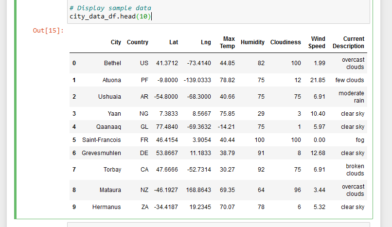
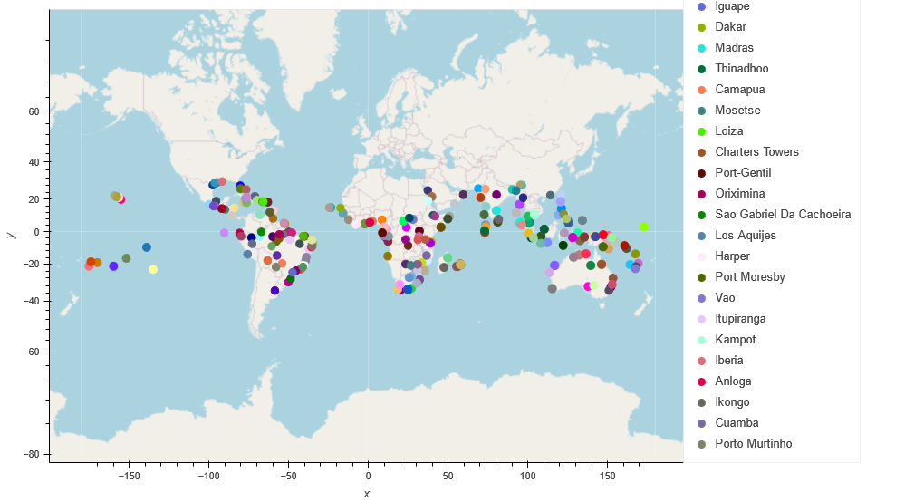
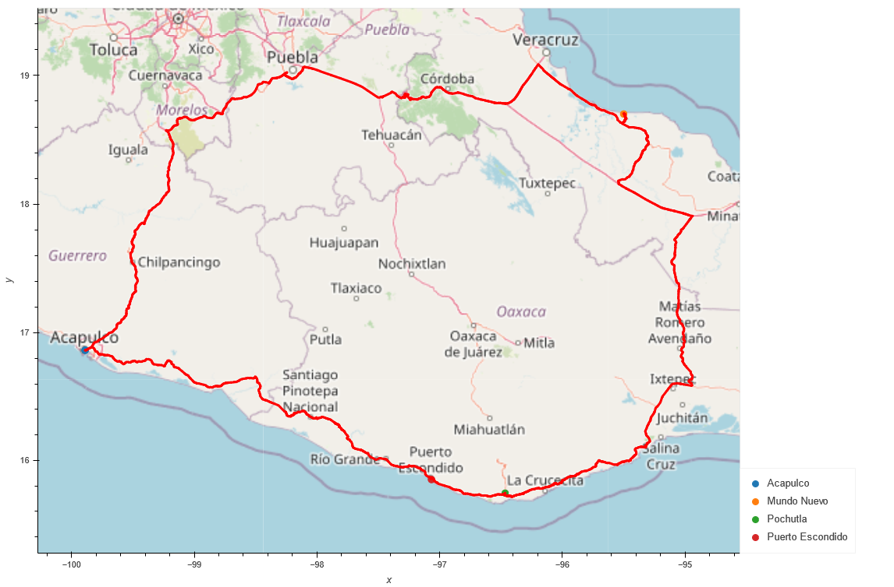

# World_Weather_Analysis
# PlanMyTrip
## Overview of Project
In this module, we were tasked with collecting and analyzing weather data across cities worldwide for a company called PlanMyTrip.

### *Purpose*
The purpose of this project was to use the collected data and create a hypothetical travel trip with hotel recommendations based on the client's weather preferences.

## Results
### Deliverable 1: Retrieve Weather Data
There were three parts to this project, for deliverable 1, I created a Pandas Data Frame with different cities using the np.random.uniform function to generate a new set of 2,000 random latitudes and 2,000 longitudes. I then used the citipy module to get the nearest city for each latitude and longitude combination. I then used my OpenWeatherMap's API key to make an API call and gather the information needed to make the DataFrame in Figure1. 

#### *Figure 1

I then exported the DataFrame as a csv file. 

### Deliverable 2: Create a Customer Travel Destinations Map
For deliverable 2, I employed input statements to retrieve the customer's weather preferences and identify potential travel destinations along with nearby hotels.  Figure 2 below shows a map of the potential travel destinations and hotels based on the provided weather preferences.

#### *Figure 2*

The weather preferences for Figure 2 were based on the following questions:
What is the minimum temperature you would like for your trip? 70
What is the maximum temperature you would like for your trip? 90

### Deliverable 3: Create a Travel Itinerary Map
For deliverable 3, a travel itinerary was created using the Geoapify Routing API.  Figure 3 shows the travel itinerary, which depicts the route between four cities chosen from the customer's possible travel destinations based on weather preferences. The route starts and ends at the city of "Acapulco."

#### *Figure 3*

## Summary
A city in the US was selected after generating the random range of latitudes and longitudes. However, the four cities found within the same country and closest to the selected city in the US were in Mexico.  I think that the reason as to why I got cities from another country is because of the minimum (70) and maximum temperatures (90) in Fahrenheit that I chose. It is so cold in the US right now, that these temperatures were probably hard to find in real time when I was working on the project. This means the data will change constantly.  